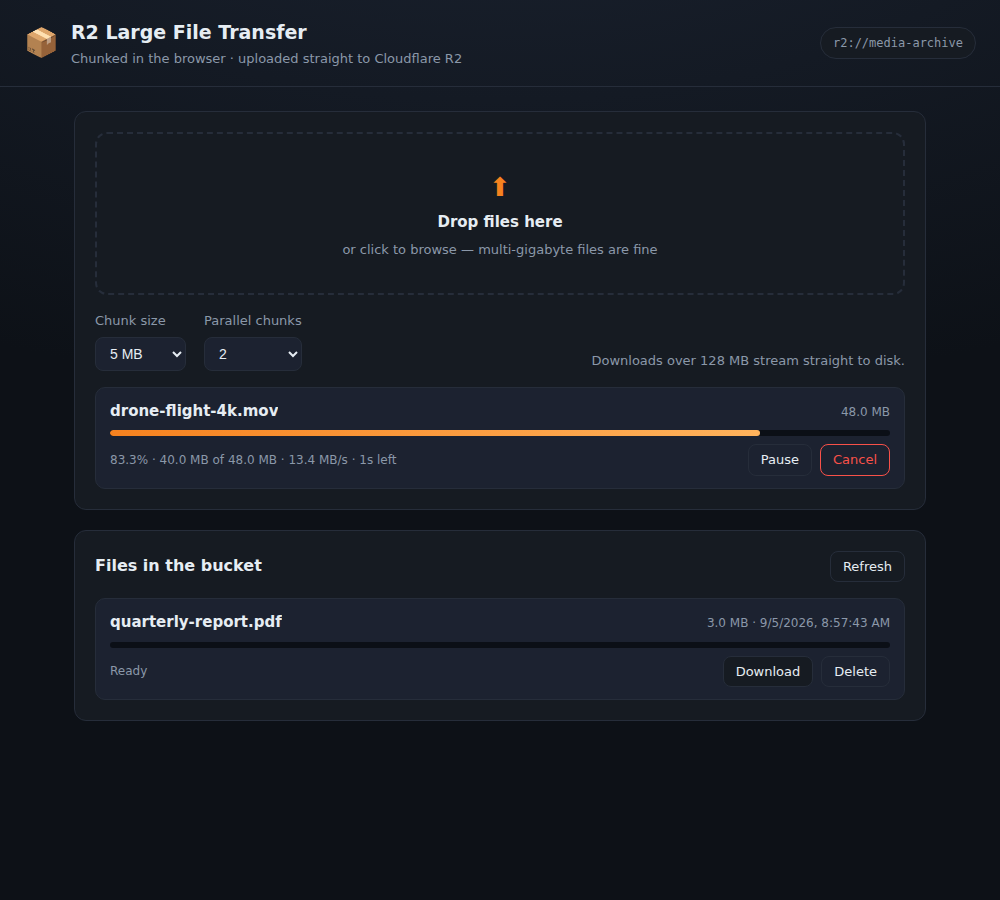

# upload-r2

Upload and download very large files to **Cloudflare R2** — with the chunking done
in the browser.

The server never touches the file bytes. It hands the browser presigned URLs, and
the browser slices the file with `File.slice()` and PUTs every chunk straight to
R2. A 50 GB upload costs the server a few kilobytes of JSON.



```
browser                         this server                 Cloudflare R2
   |  POST /api/uploads/create  ---->  CreateMultipartUpload ---->  |
   |  <---- key + uploadId + partSize                               |
   |  POST /api/uploads/sign    ---->  presign UploadPart ------->  |
   |  <---- presigned URLs                                          |
   |  PUT chunk 1..N  ============ directly to R2 ================> |
   |  POST /api/uploads/complete ---> CompleteMultipartUpload --->  |
```

## Features

**Upload**
- Browser-side chunking with a configurable chunk size (5 MB – 128 MB)
- Parallel chunk uploads (1–8 at a time) with per-chunk retry and exponential backoff
- Live progress, transfer speed and ETA
- Pause / resume / cancel — cancelling aborts the multipart upload so R2 drops the parts
- Resume after a page reload or a crash: the browser remembers the `uploadId`, asks R2
  which parts already landed (`ListParts`) and sends only the rest
- Part size is raised automatically so any file fits inside R2's 10 000-part limit
- Files under 5 MB skip multipart and use a single presigned PUT
- Drag & drop, multiple files at once

**Download**
- Parallel HTTP `Range` requests, reassembled in order
- Files over 128 MB stream straight to disk via the File System Access API, so a
  50 GB download never has to fit in memory (Chromium-based browsers); elsewhere the
  chunks are collected as Blobs and saved at the end
- Progress bar, cancel, and retry on failed ranges

**Server**
- Presigned URLs only — no proxying, no temp files, no memory pressure
- Object keys are generated server-side and validated on the way back in, so a browser
  cannot read or overwrite anything outside the configured prefix
- Bucket listing and delete

## Setup

```bash
npm install
cp .env.example .env     # then fill in your R2 credentials
npm run cors             # one-off: let the browser talk to the bucket
npm start                # http://localhost:3000
```

### 1. Credentials

In the Cloudflare dashboard: **R2 → Manage API tokens → Create API token**
(`https://dash.cloudflare.com/<account_id>/r2/api-tokens`), with *Object Read & Write*
scoped to your bucket. The result page shows a *Token value* for the REST API and,
below it, the **Access Key ID** and **Secret Access Key** for the S3 API — this app
needs the latter two. Put the values in `.env`:

| Variable | What it is |
| --- | --- |
| `R2_ACCOUNT_ID` | Cloudflare account ID (R2 → Overview) |
| `R2_ACCESS_KEY_ID` / `R2_SECRET_ACCESS_KEY` | From the R2 API token |
| `R2_BUCKET` | Bucket name |
| `R2_KEY_PREFIX` | Folder everything is stored under (default `uploads/`) |
| `PRESIGN_EXPIRES` | Lifetime of presigned URLs in seconds (default 3600) |
| `MAX_FILE_SIZE` | Upload ceiling in bytes (default 5 TiB, R2's object limit) |
| `CORS_ORIGIN` | Origins allowed to reach the bucket from a browser |
| `R2_FORCE_PATH_STYLE` | `true` for MinIO or other S3 mocks |
| `PORT` | Port to listen on (default 3000; Railway sets this for you) |

### 2. Bucket CORS — required

The browser talks to R2 directly, so the bucket must allow it. `npm run cors` applies:

```json
[
  {
    "AllowedOrigins": ["http://localhost:3000"],
    "AllowedMethods": ["GET", "PUT", "HEAD", "DELETE"],
    "AllowedHeaders": ["*"],
    "ExposeHeaders": ["ETag", "Content-Length", "Content-Range", "Content-Type"],
    "MaxAgeSeconds": 3600
  }
]
```

`ExposeHeaders: ["ETag"]` is not optional: the browser has to read each part's ETag
and send it back when completing the multipart upload. Without it every upload fails
at the first chunk.

Set `CORS_ORIGIN` to your real origin (comma-separate several) before deploying. The
origin is where the *page* is served from, not the R2 endpoint, and it must carry no
trailing slash. Re-run the script whenever the domain changes — the rules live on the
bucket, so the running server never notices a stale one.

**If `npm run cors` fails with `AccessDenied`**: editing bucket configuration needs an
R2 token with **Admin Read & Write**. The *Object Read & Write* token the app itself
runs on cannot do it. Either create a second token with the wider permission just for
this, or paste the rules above into the dashboard by hand under
**R2 → your bucket → Settings → CORS Policy** — the script prints them for you when it
hits this error.

## Deploy to Railway

`railway.json` and `nixpacks.toml` are already in the repo, so a deploy is just:

```bash
railway login
railway init          # or: railway link, for an existing project
railway up
```

Railway builds with Nixpacks, installs runtime dependencies only
(`npm ci --omit=dev`, so Playwright never downloads a browser on the server),
starts `node server/index.js` and waits for `/healthz` before switching traffic
to the new deploy. `PORT` is injected by Railway and picked up automatically.

**1. Set the variables** (Railway dashboard → Variables, or `railway variables --set`):

```
R2_ACCOUNT_ID=...
R2_ACCESS_KEY_ID=...
R2_SECRET_ACCESS_KEY=...
R2_BUCKET=...
```

Do not set `PORT`. `CORS_ORIGIN` is optional on Railway: with nothing set the app
falls back to `https://$RAILWAY_PUBLIC_DOMAIN`, which is the domain Railway gave the
service. Set it explicitly once you attach a custom domain (comma-separate several).

**2. Generate a domain**: Settings → Networking → Generate Domain.

**3. Apply the bucket CORS rules for that domain** — the browser uploads straight to
R2, so this is not optional:

```bash
railway run npm run cors
```

`railway run` executes locally with the service's variables, so it picks up
`RAILWAY_PUBLIC_DOMAIN` and allows the right origin. Re-run it whenever the domain
changes. To check what is currently applied, the script prints the rules back. It needs
an *Admin Read & Write* token — see the CORS section above if it answers `AccessDenied`.

Two things worth doing before letting anyone else near the URL: put the app behind
authentication (see the notes at the end of this file), and add an R2 lifecycle rule
that aborts incomplete multipart uploads after a few days.

## API

| Method | Route | Purpose |
| --- | --- | --- |
| `GET` | `/healthz` | Health check for the platform |
| `GET` | `/api/config` | Bucket name and client defaults |
| `POST` | `/api/uploads/create` | Reserve a key, open a multipart upload |
| `POST` | `/api/uploads/sign` | Presigned URLs for a batch of part numbers |
| `GET` | `/api/uploads/parts` | Parts R2 already holds (used to resume) |
| `POST` | `/api/uploads/complete` | Assemble the parts into the final object |
| `POST` | `/api/uploads/abort` | Cancel and let R2 discard the parts |
| `GET` | `/api/files` | List objects under the prefix |
| `GET` | `/api/files/download-url` | Presigned GET + size, for ranged downloads |
| `DELETE` | `/api/files` | Delete an object |

## How the chunking works

`public/js/uploader.js` is the interesting file.

- **Part size.** R2 requires every part except the last to be exactly the same size,
  at least 5 MiB, and at most 10 000 parts per upload. `choosePartSize()` doubles the
  requested size until the file fits; a 5 TiB file ends up with ~537 MiB parts.
- **The worker pool.** Part numbers go into a queue and *N* workers pull from it, so
  *N* chunks are in flight at any moment. Each chunk is `file.slice(start, end, '')` —
  the empty type stops the browser from adding a `Content-Type` header that was not
  part of the signature.
- **Progress.** `XMLHttpRequest` is used instead of `fetch` because it reports upload
  progress. Bytes are counted incrementally and rolled back when a chunk is retried,
  so the bar never overshoots.
- **Signing.** URLs are fetched 100 at a time and re-signed if they are within a
  minute of expiry, so an upload running for hours never dies of a stale signature.
- **Interruptions.** Pause aborts the in-flight `XMLHttpRequest`s; the parts return to
  the queue. R2 keeps the parts that already landed, so resuming picks up where it
  stopped, even after a reload.

`public/js/downloader.js` mirrors it for the way down: ranged `fetch()` calls fanned
out across workers, written to disk in order, with a lookahead window that keeps
memory bounded no matter how big the file is.

## Tests

```bash
npm test        # unit tests for key handling and part sizing
npm run test:e2e   # drives a real Chromium against an in-memory R2 mock
```

If Playwright cannot find a browser (or you want to reuse one already on the machine),
point it at the binary: `CHROMIUM_PATH=/path/to/chrome npm run test:e2e`.

The end-to-end tests upload a 40 MB file through the actual UI, checks that it
arrived as 8 chunks and hashes byte-for-byte, then downloads it back with range
requests and hashes it again. A second test pauses an upload halfway, reloads the
page, hands the same file back and checks that only the missing chunks are sent.

## Notes before deploying

- **There is no authentication.** Anyone who can reach the server can upload to and
  delete from your bucket. Put it behind your own auth (a session check in
  `server/index.js` before the routers is enough) before exposing it.
- Consider an R2 lifecycle rule to abort incomplete multipart uploads after a few
  days, so cancelled uploads do not accumulate storage cost.
